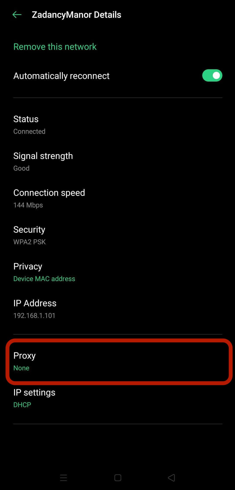
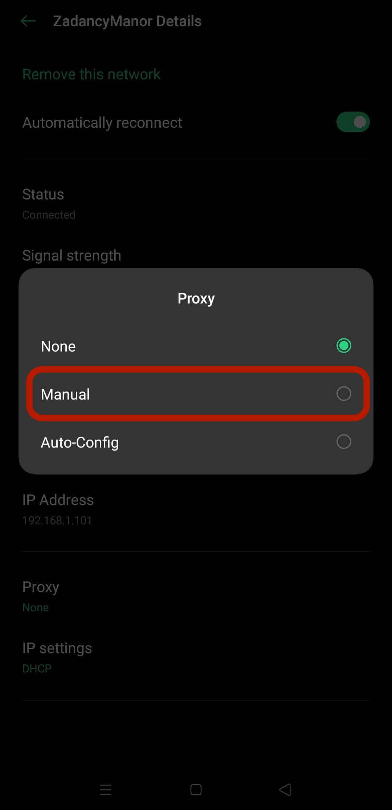
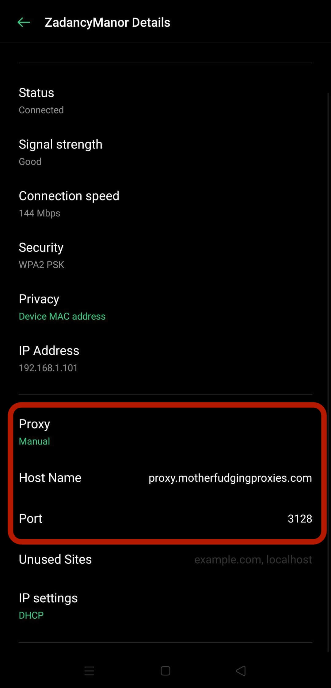

# <i class="i-android"></i> Android OS :id=android

There's no real consistent Android proxy setting way of doing things because all the various flavours, but this is a _semi_-example:

1. Go to the Settings app

1. Go to the Wifi options and select the preferred wifi

 

1. Select `Proxy`

 

1. Select `Manual`

 

1. Enter your proxy details

 

?> On this phone I used there were no authentication options. When connecting to the browser it did request them, but you can't tell if those credentials are for just the browser or all apps

## Helpers

Let's be blunt - any proxy apps on the Play Store are only for debugging not forwarding to your corporate proxy servers.

They only let you analyse your phone's network traffic, but don't solve any proxy connection issues :disappointed:

So in short, you're tied in to native proxy settings.

[footer nav](../site/footer.md ':include')
