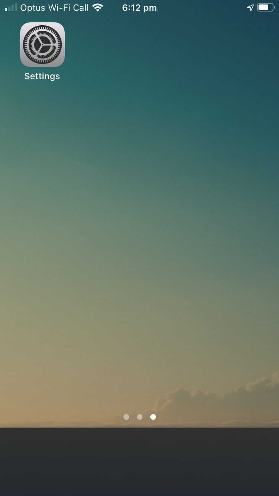
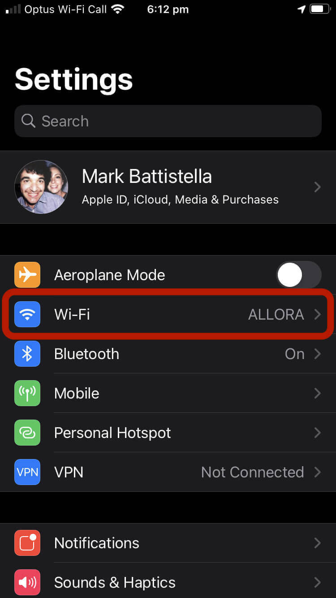
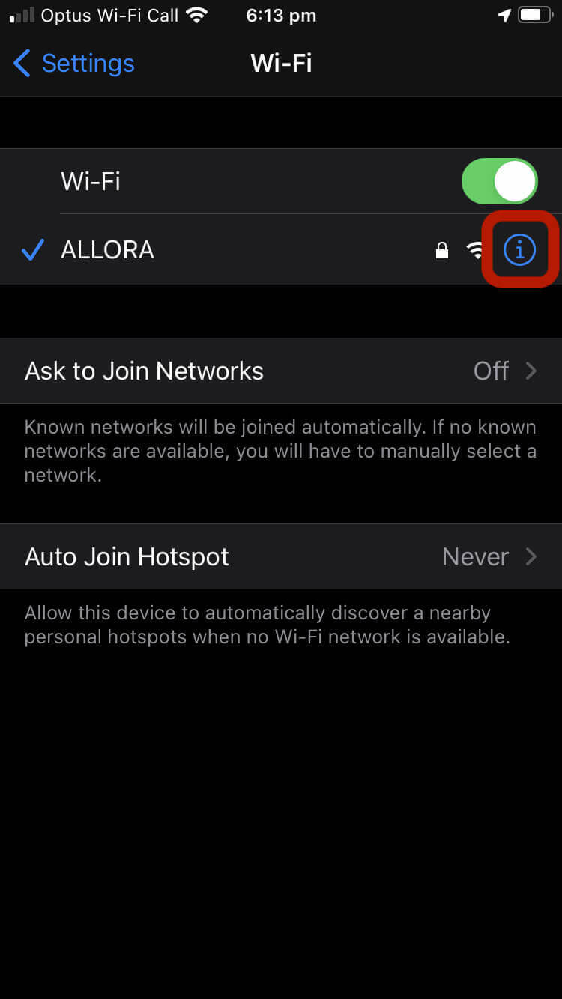
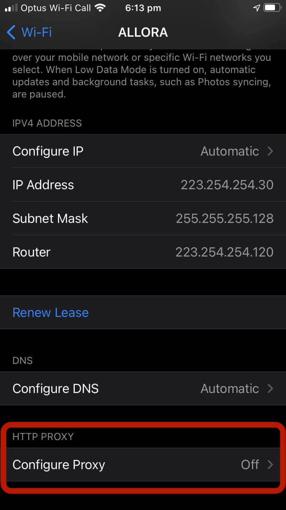
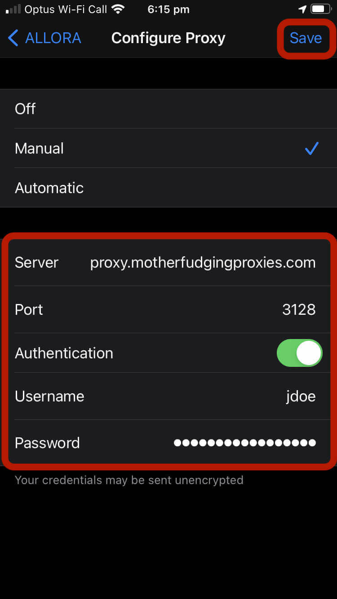

# <i class="i-ios"></i> iOS / iPadOS :id=ios

### Settings (iOS and iPadOS)

1. Open the `Settings` app

 

1. Enter the Wi-Fi settings view

 

1. Press the :information_source: icon

 

1. Scroll to the bottom, and press `Configure Proxy`

 

1. Change the setting to `Manual`, and enter the proxy settings. Press `Save` _not_ back or else you'll lose everything you just entered :facepalm:

 

The only helpers you can use on iOS devices is using Squid or Charles on another machine, and then point your iOS device to use that as the proxy server.

Charles _does_ have an iOS and iPadOS app, but it is only for debugging not forwarding to the main proxy server :disappointed:

So in short, you're tied in to native proxy settings.

[footer](../site/footer.md ':include')
