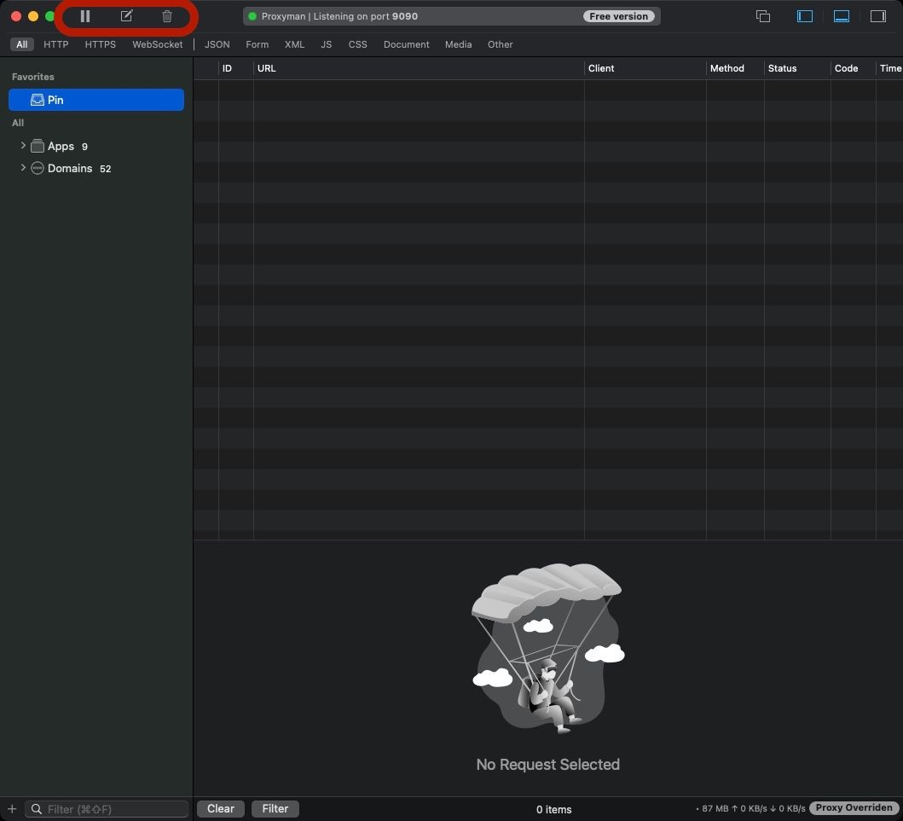
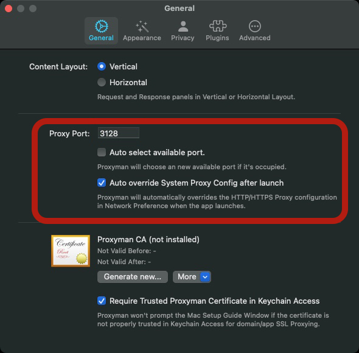
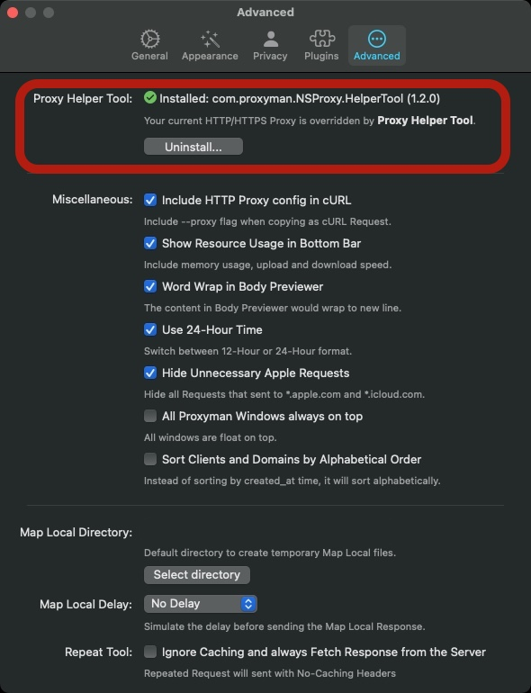
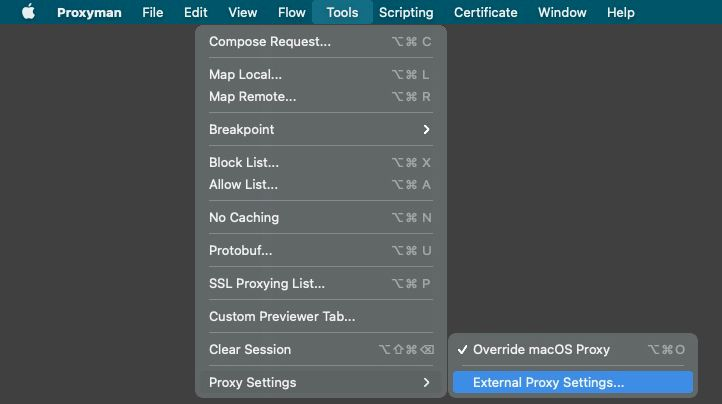
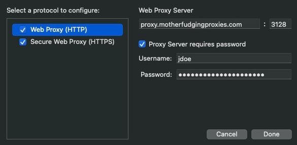
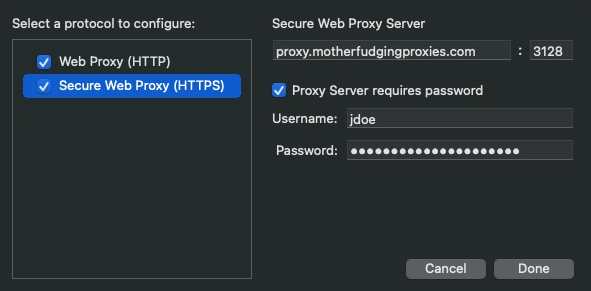
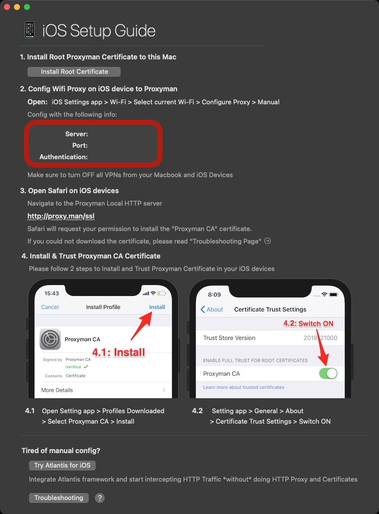
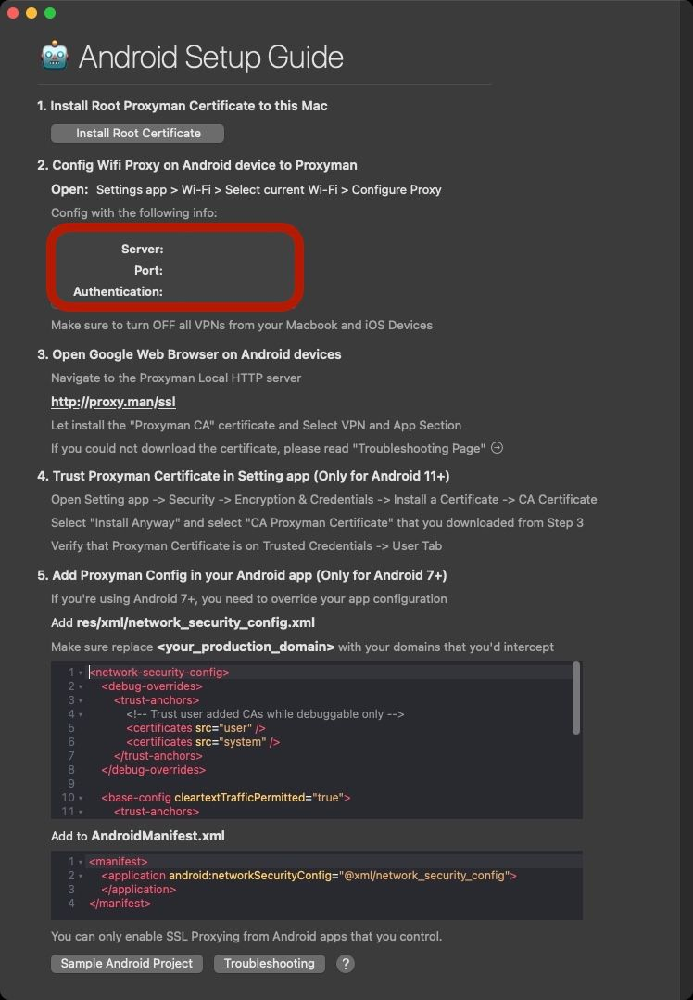

# <i class="i-macos"></i> macOS :id=macos

## Standard way

### System Preferences

1. Open `System Preferences`

 

1. Select `Network`

 

1. Click the network adapter from the side bar, and press `Advanced`

 

1. Go to the `Proxies` tab

 

1. Check `Web Proxy (HTTP)`, `Secure Web Proxy (HTTPS)`, and `FTP Proxy`

  
  
 

1. Enter your proxy settings in the right side pane:

   1. Proxy server: `proxy.motherfudgingproxies.com`
   1. Proxy port: `3128`
   1. Username: `jdoe`
   1. Password: `MySecurePassword`

1. Press `OK` and `Apply`

 

1. You will need to repeat this for every network adapter you use for internet

?> This site also assumes you're using standard proxies, and not SOCKS

## Helpers

Helper apps are really good at tunnelling all the network traffic into the localhost and then sending it through to the external proxy server.

When using these apps the above macOS settings for proxy should be configured to the localhost or `127.0.0.1` and whatever port you use from the app (`3128` in these examples).

### [SquidMan](https://squidman.net/squidman/)

1. Open the app

 

1. Open the preferences `CMD + ,`

1. Under `General`, set the port that the device will use to connect (this example I'm using the same port as the proxy `3128`)

 

1. Go to the `Parent` tab, and if you use multiple locations select the one from the sidebar and enter the proxy settings.

 

 ?> This is my favourite thing about SquidMan - I have a "home" location for wifi, and then a "proxy" wifi

1. If you need to share your internet proxy tunnelling to others that can install or are mobile devices then you have the ability to limit the access

 

1. `Save` the settings, and then press `Start Squid` to start tunnelling

 
 

### [Proxyman](https://proxyman.io)

1. Open the app

 

1. Stop the recording and clear the session

 

1. Open the preferences `CMD + ,` and under `General` set the port to `3128`, and uncheck `Auto select available port`

 

1. Then go to `Advanced` and install the `Proxy Helper Tool`

 

1. From the menubar, check the `Override macOS Proxy` and then open `External Proxy Settings...`

 

1. Fill in the HTTP and HTTPS settings

 
 

1. _(optional)_ To set up iOS and Android follow the guides in the app

 !> It is important to note that using these proxy settings for iOS / iPadOS / Android don't forward directly to the external proxy server. They go to your macOS machine (so it is really hit-and-miss with success rates)

 
 

### [Charles Proxy](https://www.charlesproxy.com)

!> Charles proxy debugging is not supposed to be used for network tunnelling, but it works as a by-product. As a result, leaving it on 24/7 means most of your device's resources get eaten up by the session recorder. This shows you how to turn it off

1. Open the app

 
 

1. Stop the recording and clear the session

 

1. Open the preferences `CMD + ,` and under `Launch` uncheck the `Open new session` and press `OK`

 

1. From the menubar, turn on `macOS Proxy`

 

1. From the menubar, open up the `Proxy Settings...`

 

1. Set the port that the device will use to connect (this example I'm using the same port as the proxy `3128`)

 

1. Under the `macOS` tab that all the options are checked

 

1. From the menubar, open up the `External Proxy Settings...`

 

1. Check the `Use external proxy servers` option and fill in the HTTP and HTTPS settings

 
 

1. Press `OK`

[footer](../site/footer.md ':include')
