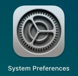
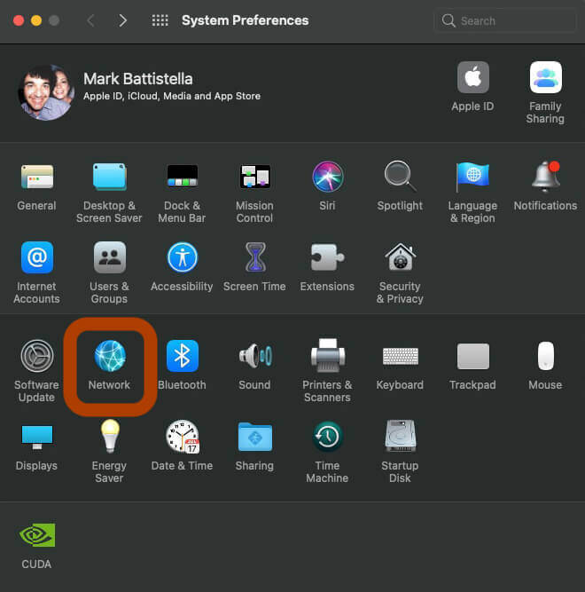
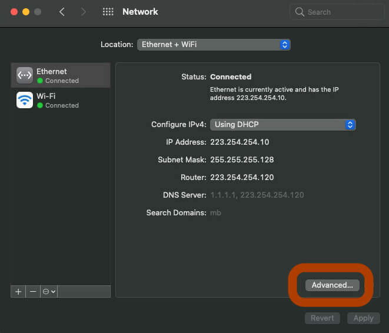
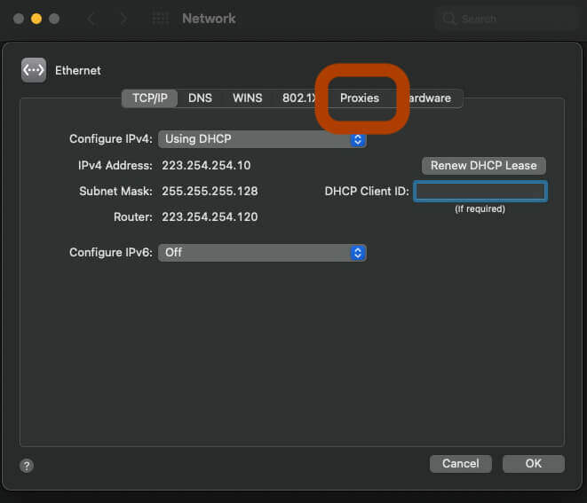
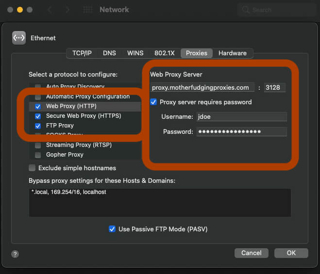
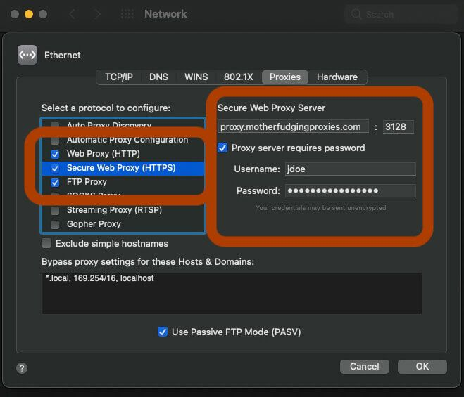
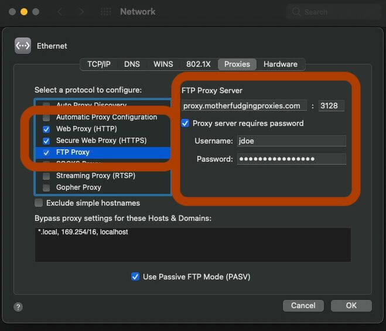
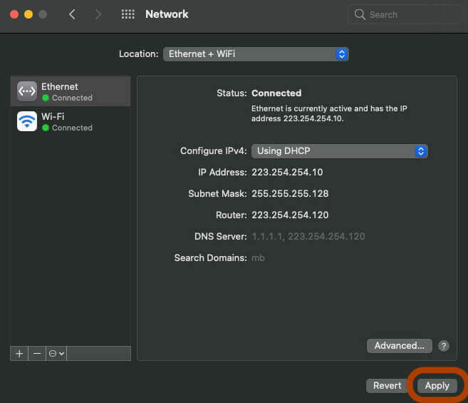

# <i class="i-macos"></i> macOS :id=macos

## Standard way

### System Preferences

1. Open `System Preferences`

 

1. Select `Network`

 

1. Click the network adapter from the side bar, and press `Advanced`

 

1. Go to the `Proxies` tab

 

1. Check `Web Proxy (HTTP)`, `Secure Web Proxy (HTTPS)`, and `FTP Proxy`

  
  
 

1. Enter your proxy settings in the right side pane:

   1. Proxy server: `proxy.motherfudgingproxies.com`
   1. Proxy port: `3128`
   1. Username: `jdoe`
   1. Password: `MySecurePassword`

1. Press `OK` and `Apply`

 

1. You will need to repeat this for every network adapter you use for internet

?> This site also assumes you're using standard proxies, and not SOCKS

## Helpers

Helper apps are really good at tunnelling all the network traffic into the localhost and then sending it through to the external proxy server.

When using these apps the above macOS settings for proxy should be configured to the localhost or `127.0.0.1` and whatever port you use from the app (`3128` in these examples).

[footer](../site/footer.md ':include')
