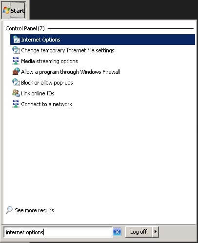
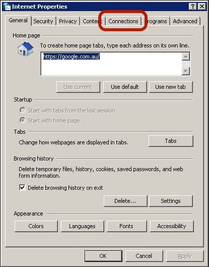
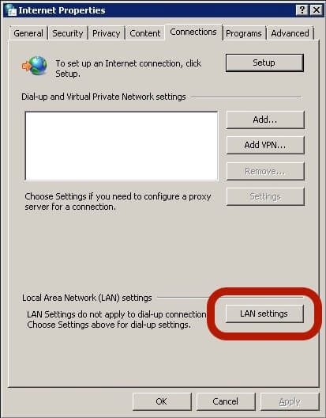
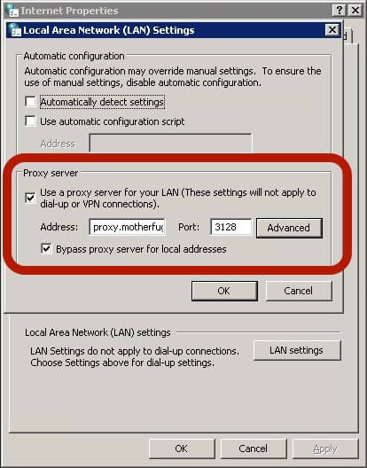
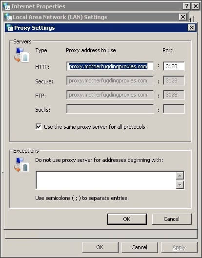
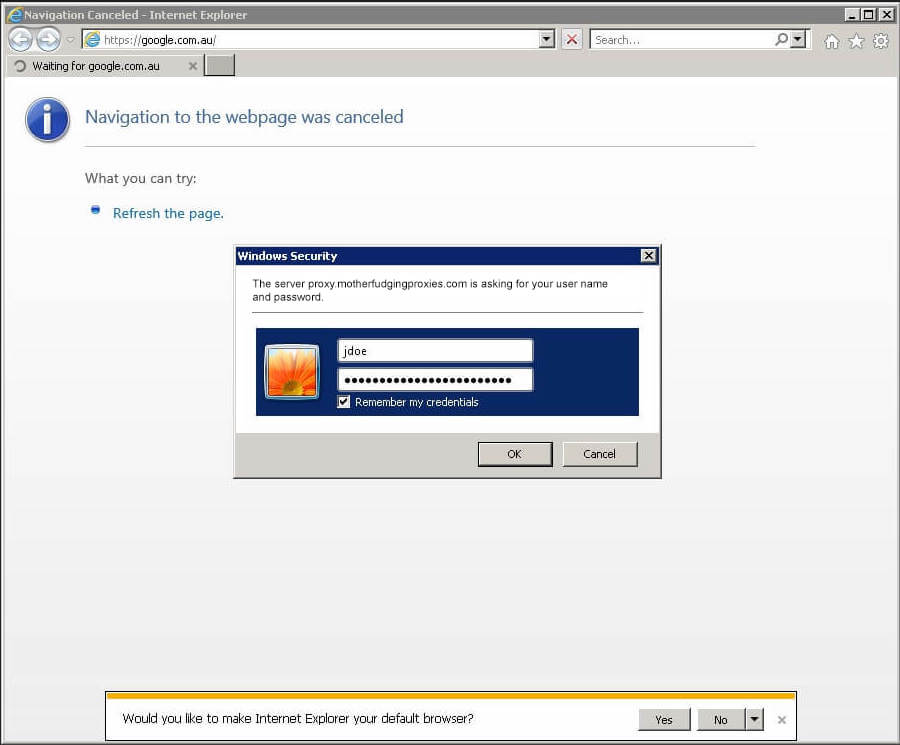
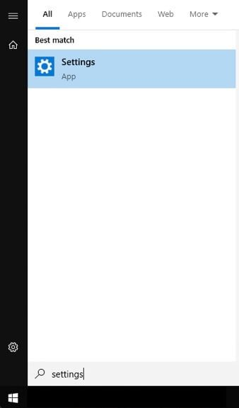
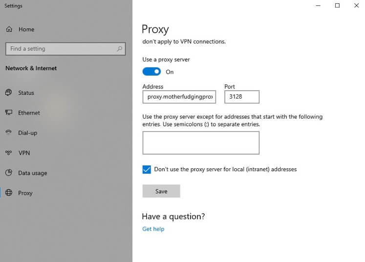

# <i class="i-windows"></i> Windows :id=windows

Windows was fairly consistent in their proxy settings up until they released their new interfaced version and new transitional Settings App.

Usually when you configure one of the places for proxies in Windows it does filter to the other, but it is always good practice to make sure!

## Standard way

### Control Panel

1. Open the `Start` menu and search for `Internet Options` and open it

 

1. Go to the `Connections` tab

 

1. Towards the bottom, press the `LAN settings` button

 

1. With the pop up dialogue window, check the `Use a proxy server for your LAN`

 

1. In the address enter the proxy server address and port number

1. Check the `Bypass proxy server for local addresses`

  ?> This setting means anything that is within the scope of `.local` or in the domain will not use the proxy

1. Press the `Advanced` button to open the advanced Proxy Settings menu

 

1. Specify separate proxy addresses for each of the protocols if you need to, otherwise press `OK`

1. Open Internet Explorer (_yes_ it has to be this) and log in with your proxy credentials

 

 ?> You have to use Internet Explorer as this is the default tunnelling application on Windows. When you launch Chrome or Firefox or another app, they will prompt you again for their own authentication, but anything using the internal proxy settings channels Internet Explorer

### Settings App

1. Open the `Start` menu and search for `Settings` and open it

 

1. In the Settings app, search for **proxy** and select `Change proxy settings`

 

1. Under proxy, turn on `Use a proxy server` and enter the proxy details

 

1. Press `Save` - or else your details won't work

?> Sometimes you need to open Internet Explorer and authenticate, sometimes you don't and it will ask when you open the desired app. Sometimes you can use Edge, sometimes you can't. Microsoft, right?

## [Helpers](/proxy/helper)

Helper apps are really good at tunnelling all the network traffic into the localhost (`127.0.0.1`) and then forwarding it to the external proxy server.

Instead of using the `proxy.motherfudgingproxies.com` address, you'd enter `127.0.0.1` and let the application handle all requests.

[footer](../site/footer.md ':include')
